# **深入浅出FOC(Field Oriented Control)**

## 前言:
### 为什么要学习FOC?
    1.电机控制是自动化控制领域重要一环。
    2.目前直流无刷电机应用越来越广泛，如无人机、私服、云台、仿生机器人等等。
    3.电机控制工程师薪水较高。
### 需要什么基础？
    1.C语言，指针，结构体，编程规范。
    2.STM32外设使用。
    3.原理图阅读。
### 为什么要出本教程？
    1.直流无刷电机应用越来越广泛，网上资料比较散落，因此想要出一篇系统性的教程，从头到尾，深入浅出，帮助初学者快速入门直流无刷电机控制。
## 第一章 直流无刷电机简介

### 基本物理知识准备
#### 左手定则
[百度百科](https://baike.baidu.com/item/%E5%B7%A6%E5%8F%B3%E6%89%8B%E5%AE%9A%E7%90%86/2656410?fr=aladdin)

    已知电流方向和磁感线方向，判断通电导体在磁场中受力方向，如电动机。伸开左手，让磁感线穿入手心（手心对准N极，手背对准S极）， 四指指向电流方向 ，那么大拇指的方向就是导体受力方向。
#### 右手螺旋定则
[百度百科](https://baike.baidu.com/item/%E5%AE%89%E5%9F%B9%E5%AE%9A%E5%88%99/10784798?fromtitle=%E5%8F%B3%E6%89%8B%E8%9E%BA%E6%97%8B%E5%AE%9A%E5%88%99&fromid=2948936&fr=aladdin)

    用右手握住通电螺线管，让四指指向电流的方向，那么大拇指所指的那一端是通电螺线管的N极

### 直流有刷电机简介
    直流有刷电机通过换向器来改变电流方向，进而改变磁场方向让电机转动。由于其是机械换向，因此就带来一系列缺点。
    例如摩擦大，发热大，效率低等缺点
### 直流无刷电机简介
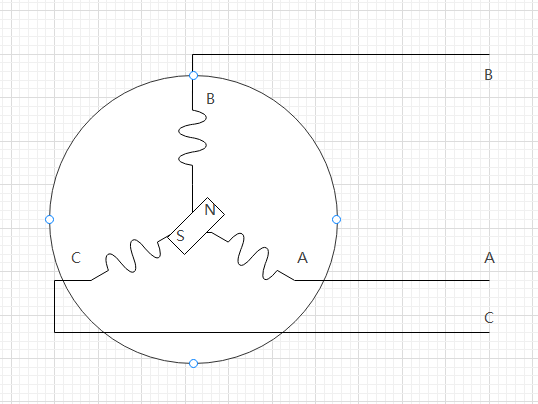

    直流无刷电机通过使用电子器件代替机械换向，解决了直流有刷电机的缺点。为了便于分析我们将直流无刷电机抽象出上图模式，定子有三个线圈组成，转子由一对磁极组成。通过改变ABC三者电流方向来改变定子产生的磁场方向，从而使磁铁转动起来。

## 第二章 六步换向控制方式
### 直流无刷电机六步换向

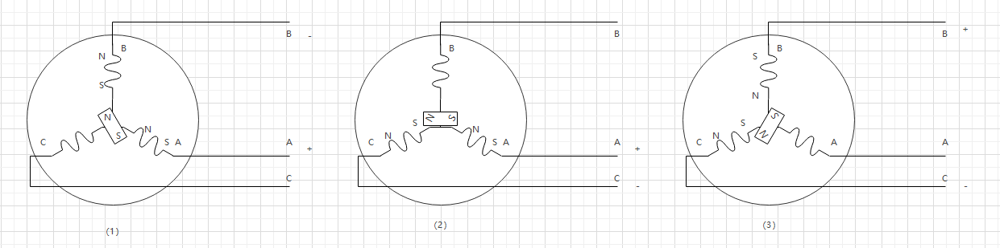
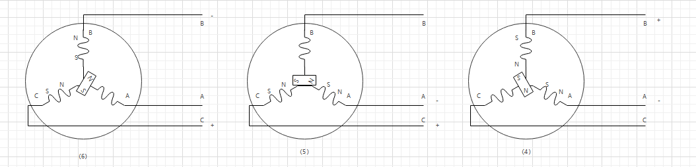

    如上图所示，通过控制ABC三相电流方向我们可以控制直流无刷电机旋转，具体步骤如下：

| 步骤    | A相电压 | B相电压 | C相电压 | 转子目标角度 |
| ------ | ------ | ------ | ------ | ------ |
| 1      | +      | -      | 悬空   |  120   |
| 2      | +      | 悬空   | -      |  180   |
| 3      | 悬空   | +      | -      |  240   |
| 4      | -      | +      | 悬空   |  300   |
| 5      | -      | 悬空   | +      |  0     |
| 6      | 悬空   | -      | +      |  60    |

    可以看出，我们只需要像步进电机那样不断的重复这六部换向就可以让BLDC转动起来，甚至会产生一种错觉，是不是我们换向越快电机转的越快呢？答案是否，这里我们一定要认识到，是当转子处于特定位置时才去触发换向操作，具体如下表所示。

#### 正转：
| 转子实际角度 | 执行步骤 | 转子目标角度 |
| ------  | ------ | ------ |
| 60-120  | 1      | 120 |
| 120-180 | 2      | 180 |
| 180-240 | 3      | 240 |
| 240-300 | 4      | 300 |
| 300-0   | 5      | 0   |
| 0-60    | 6      | 60  |

#### 反转

| 转子实际角度 | 执行步骤 | 转子目标角度 |
| ------  | ------ | ------ |
| 60-120  | 6      | 60     |
| 60-0    | 5      | 0      |
| 0-300   | 4      | 300    |
| 300-240 | 3      | 240    |
| 240-180 | 2      | 180    |
| 180-120 | 1      | 120    |

#### 如何获得转子角度？
    我们已经知道了要先检测角度再去换向，那么如何检测当前角度呢？，有以下三种方式。
    1.通过安装编码器来计算出当前角度。
    2.通过安装霍尔元件计算当前角度。
    3.通过检测电流来回切当前角度
#### 编码器方式获取电机当前角度
    编码器方式分为两种，增量式编码器和绝对式编码器。
    增量式编码器：
    每次启动之气都需要做一次校准，而且为了防止单片机性能问题导致脉冲丢失，还需要对编码器每圈校准一次。因此经常使用ABZ三周编码器，AB输出正交信号，Z输出中断
    绝对式编码器：
    只需要在出厂之前做一次校准，之后如果没有拆机便不需要校准，通讯方式一般是SPI和IIC,需要考虑通许时间对系统的影响。
#### 霍尔元件获取电机当前角度
    霍尔元件有两种安装方式互差120°和互差60°两种方式，因此在使用之前要判断电机是那种。

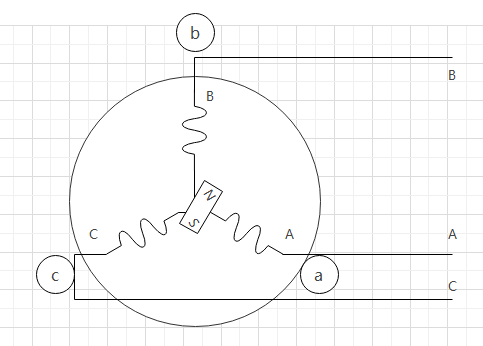

    霍尔电平和转子角度之间的对应关系如下表所示

| 转子实际角度 | 霍尔元件a电平 | 霍尔元件a电平 | 霍尔元件c电平 |
| ------  | ------ | ------ | ------ |
| 60-120  | 0      | 1      | 0      |
| 120-180 | 0      | 1      | 1      |
| 180-240 | 0      | 0      | 1      |
| 240-300 | 1      | 0      | 1      |
| 300-0   | 1      | 0      | 0      |
| 0-60    | 1      | 1      | 0      |

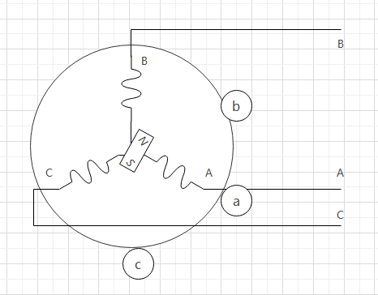

    霍尔电平和转子角度之间的对应关系如下表所示

| 转子实际角度 | 霍尔元件a电平 | 霍尔元件a电平 | 霍尔元件c电平 |
| ------  | ------ | ------ | ------ |
| 60-120  | 0      | 1      | 0      |
| 120-180 | 0      | 0      | 0      |
| 180-240 | 0      | 0      | 1      |
| 240-300 | 1      | 0      | 1      |
| 300-0   | 1      | 1      | 1      |
| 0-60    | 1      | 1      | 0      |

#### 检测电流获取电机当前角度

由于电机旋转过程中产生的电流理想波形如下图

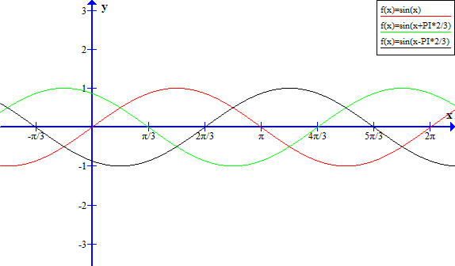

根据采集到的电流就可以判断出电机当前的角度在哪个范围。
具体分析在FOC控制方法中讲解。
#### 程序编写

#### 引出问题
    相信看到这里大家都有一些疑问，就是六步换向的方式只能控制电机正反转，然后通过控制相电压调节转速，那么如何控制电机位置呢，而且这种方式有一部分电流是让电机旋转，有一部分是让电机发热，那么如何做到效率最高呢。通过观察电流发现，电机三相电流并不是正弦波，是为了解决以上问题，FOC矢量控制便运用而生。

## 第三章 FOC矢量控制

### FOC控制框架图

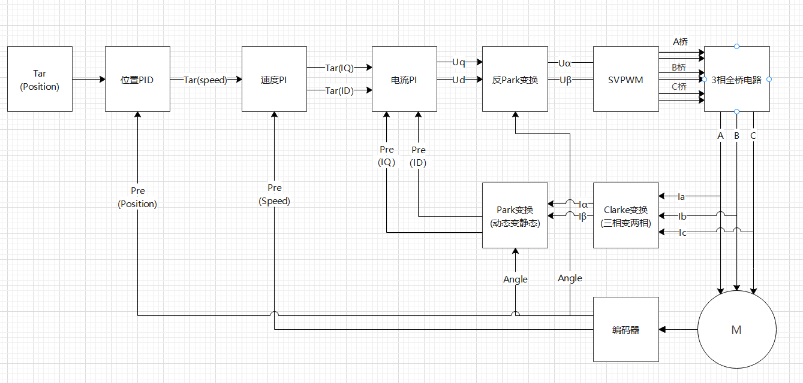

    相信很多人在网上都看到过这个控制框图，咋一看还挺负载，充斥着各种变化及检测，很多资料直接对着这个框图进行讲解，而本教程到这里只是让大家对这个框图有基本印象，接下来我们逐步分析各个模块来源，让大家都能自己画出来这个控制框图。

### 控制框图简化

    看着FOC详细控制框图我们发现无从下手，不知道从哪坐起，我们回想一下直流有刷电机的学习过程，首先是让电机转起来，然后进行速度控制，再进一步进行位置控制，同样我们在FOC学习过程中依然可以这样做，我们首先讲位置环和速度环去掉，然后就剩下SVPWM，和电流检测部分，既然只是让电机转起来那么电流检测也不需要了，我们就直接给一个目标速度，开环运行，这时候控制框架就能简化成下图所示。
    备注：(这时候可能会有人有疑问，我们不是用六步换向的方式已经让电机转动起来了吗，为什么这里又要学习如何让电机转动？是因为六步换向方式存在一些缺点，而这里是另一种控制方式让电机转动更加平滑，效率更高。)

    接下来我们对这部分做详细讲解

### IQ与ID介绍

    仔细观察我们可以发现当我们的三相绕组产生的磁场方向始终与转子磁铁相切的时候最为理想，这样相同电流下产生的旋转力量最大，当我们三相绕组产生的磁场方向与电机磁场方向反向平行时，这时候电机会被吸在原地不动，电流都用来产生热量。因此我们以转子磁铁为参考，建立DQ坐标系，DQ坐标系随转子转动，具体如下图所示。

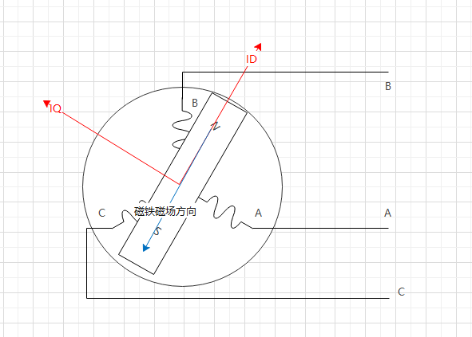

    如图当我们让ID为0 TQ为1则转子就会逆时针旋转，且转速随着IQ的变大而变大。
    如图当我们让ID为1 TQ为0则转子就会定在原地，且发热量随着ID的变大而变大。
    因此可以总结一下，要想让转子平稳的转动下去就需要让三相绕组产生的磁场方向一直和转子磁铁的磁场方向垂直，即图中的IQ,同时使ID尽可能为0。由此变引入Park反变化。

### Park反变换

    我们知道DQ坐标系是旋转坐标系，但我们的三相绕组是静止的，因此首要任务是将旋转坐标系变换为静止坐标系，即找到一个静止坐标系使其产生的磁场等同于DQ坐标其，我们将这个坐标系命名为αβ坐标系，其中由DQ坐标系向αβ坐标系这一变换过程称为反Park变换。

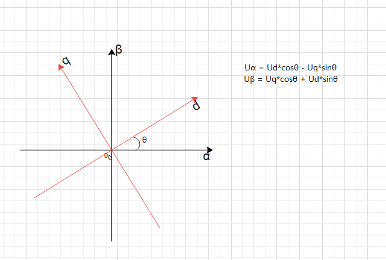

    其中阿尔法轴与a相绕组对齐。
    Uα = Ud*cosθ - Uq*sinθ
    Uβ = Uq*cosθ + Ud*sinθ
    但是我们最终能控制到的硬件是三相全桥即六个MOS管的导通，因此我们最终要的是MOS管的导通时间，即定时器输出的高电平时间，即PWM的占空比，因此我们接下来要通过Uα和Uβ求出Mos导通时间。

### 8个矢量介绍

    为了通过Uα和Uβ求出Mos导通时间我们首先要明白我们的6个MOS通过不同的导通配置会产生哪些效果，由于同一桥臂上下两个MOS不能同时导通，因此6个MOS总共由8种状态，由于每种状态都会产生一个固定方向的磁场，我们将8种状态称为8种矢量。

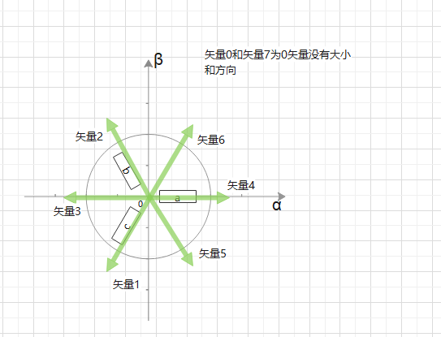

| 矢量 | a桥臂状态 | b桥臂状态 | c桥臂状态 |
| -----| ------ | ------ | ------ |
| 0    | 0      | 0      | 0      |
| 4    | 1      | 0      | 0      |
| 6    | 1      | 1      | 0      |
| 2    | 0      | 1      | 0      |
| 3    | 0      | 1      | 1      |
| 1    | o      | 0      | 1      |
| 5    | 1      | 0      | 1      |
| 7    | 1      | 1      | 1      |

    假设我们的电机处于0°位置，那么要想让电机转动起来我们只需要产生一个90°的矢量，那么只需要在一个周期内矢量2和矢量6作用的时间各占一半即可产生一个90°的矢量，总结来说就是我们通过控制相邻矢量的比例可以控制矢量的方向，通过插入0矢量可以改变矢量的大小，因此我们通过在一个控制周期内通过8个矢量的配比来产生任意方向的矢量。

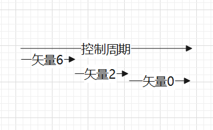

    我们知道了8个矢量的方向，接下来便是矢量大小，由于三相绕组阻值基本一样，因此每个矢量的最大值为Udc*2/3，其中Udc为母线电压（电源电压）,但我们发现各个方向上矢量最大值并不一样，为了让电机平滑转动，我们的目标矢量的最大值应为上图中六边形的内切圆的半径，即Udc*2/3*sqrt(3)/2 = Udc/sqrt(3).

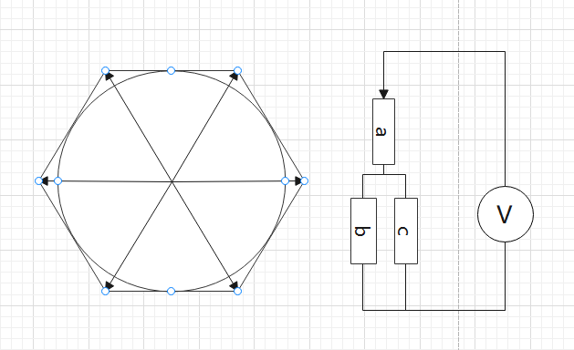

### SVPWM生成

    我们知道Uα和Uβ是我们的输入，8个矢量是我们的输出，那么怎么把输入和输出对应起来呢。不妨我们先看一个例子，例如我们想要产生0-60°的任意一个方向的矢量。

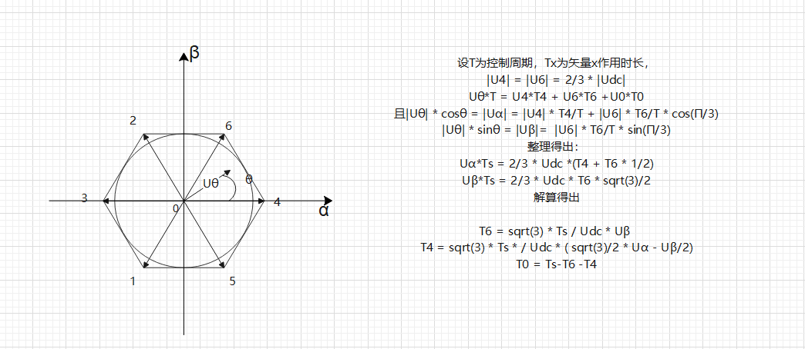

通过计算我们可以得出其他几个扇区的矢量作用时长
假设 K = sqrt(3) * Ts / Udc
U1 = Uβ
U3 = sqrt(3) / 2 * Uα - Uβ/2
u2 = -sqrt(3) / 2 * Uα - Uβ/2

| 扇区 | T0 | T1 | T2 | T3 | T4 | T5 | T6 | T7 |
| -----| ------ | ------ | ------ | ------ | ------ | ------ | ------ | ------ |
| 1    | (Ts-T4-T6)/2      | 0      | 0      | 0      | K*U3   | 0      | K*U1   | (Ts-T4-T6)/2   |
| 2    | (Ts-T2-T6)/2      | 0      | -K*U3  | 0      | 0      | 0      | -K*U3  | (Ts-T2-T6)/2   |
| 3    | (Ts-T2-T3)/2      | 0      | K*U1   | K*U2   | 0      | 0      | 0      | (Ts-T2-T3)/2   |
| 4    | (Ts-T1-T3)/2      | -K*U1  | 0      | -K*U3  | 0      | 0      | 0      | (Ts-T1-T3)/2   |
| 5    | (Ts-T1-T5)/2      | K*U2   | 0      | 0      | 0      | K*U3   | 0      | (Ts-T1-T5)/2   |
| 6    | (Ts-T4-T5)/2      | 0      | 0      | 0      | -K*U2  | -K*U1  | 0      | (Ts-T4-T5)/2   |

    得出上表之后我们要做的就是扇区判断了，之前讲过扇区判断有3种方式，其中电流检测在这里讲解。

### 反Clark变换引入

    在之前我们讲解了反Park变换，接下来我们引入一个新的知识点，反Clark变换。

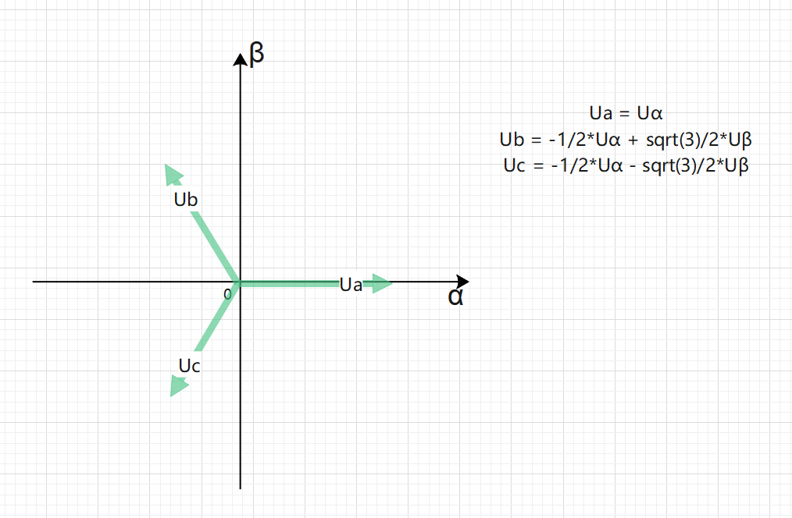

    Clark反变换的目的是把两个垂直的坐标系转变为三相绕组坐标系。虽然在我们的FOC开环控制框图中没有用到反Clark变换，但由于其可以用来做扇区判断，因此还是有必要引出此知识点。
    观察反Clark变换公式和我们之前U1,U2,U3可以发现，这两个公式极其相像。

### 利用电流做扇区判断

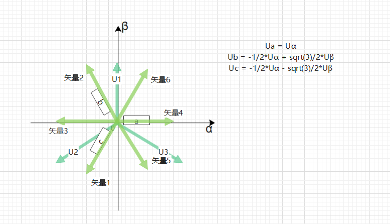

    由图可以看出我们能够使用U1 U2 U3的正负来判断当前所处扇区
    若U1>0 ，则 A=1，否则 A=0； 若U 2>0 ，则 B=1，否则 B=0；若U3>0 ，则 C=1，否则 C=0。N=4*C+2*B+A

| 扇区 | A | B | C | N |
| -----| ------ | ------ | ------ | ------ |
| 1    | 1      | 0      | 1      | 5      |
| 2    | 1      | 0      | 0      | 4      |
| 3    | 1      | 1      | 0      | 6      |
| 4    | 0      | 1      | 0      | 4      |
| 5    | 0      | 1      | 1      | 3      |
| 6    | o      | 0      | 1      | 1      |

    到此我们还剩下最后一步,如何通过矢量作用时长计算出每个MOS管导通时间，即SVPWM生成。

### 七段式SVPWM
